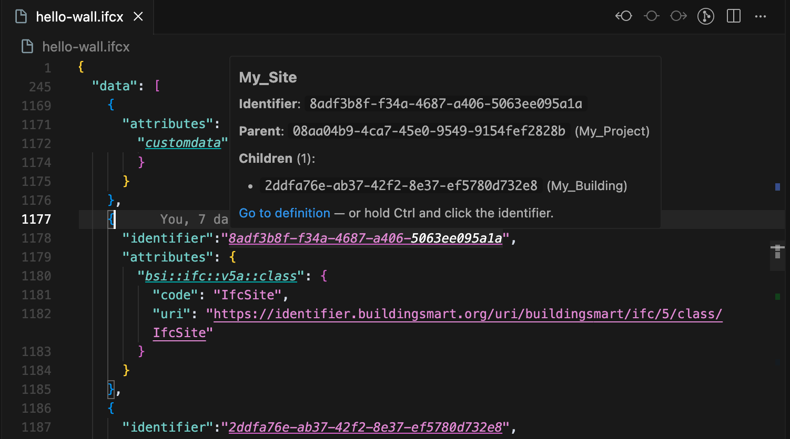

# IFCX Syntax

A Visual Studio Code extension that provides syntax highlighting and language support for IFCX files.

## Screenshots




## Features

- ✨ Syntax highlighting for IFCX files
- 🔍 Schema definition navigation and decorations
- 🏷️ Identifier decorations and definition navigation
- 📦 Auto-folding for arrays and schemas
- 🎯 JSON-based syntax with IFCX-specific enhancements

## Development Status

⚠️ **This extension is under active development** and is aligned with the [IFC5 development](https://github.com/youshengCode/IFC5-development). As IFC5 evolves, this extension will be updated to support new features and improvements. Please note that:

- The extension is currently in beta phase
- Features may change as IFC5 specifications are finalized
- Breaking changes may occur during development
- Feedback and contributions are welcome

## Configuration

Customize the extension behavior in VS Code settings:

| Setting                             | Description                   | Default |
| ----------------------------------- | ----------------------------- | ------- |
| `ifcx.schemaDefinition.enabled`     | Enable schema navigation      | `true`  |
| `ifcx.schemaDecoration.enabled`     | Enable schema decorations     | `true`  |
| `ifcx.identifierDecoration.enabled` | Enable identifier decorations | `true`  |
| `ifcx.identifierDefinition.enabled` | Enable identifier navigation  | `true`  |
| `ifcx.autoFoldArray.enabled`        | Enable array auto-folding     | `true`  |
| `ifcx.autoFoldArray.minElements`    | Min elements for auto-folding | `10`    |
| `ifcx.autoFoldSchema.enabled`       | Enable schema auto-folding    | `true`  |

## Development

```bash
# Install dependencies
pnpm install
# Start development mode
pnpm dev
```

## License

MIT | Crafted with love, caffeine, and reckless faith in IFC5.
